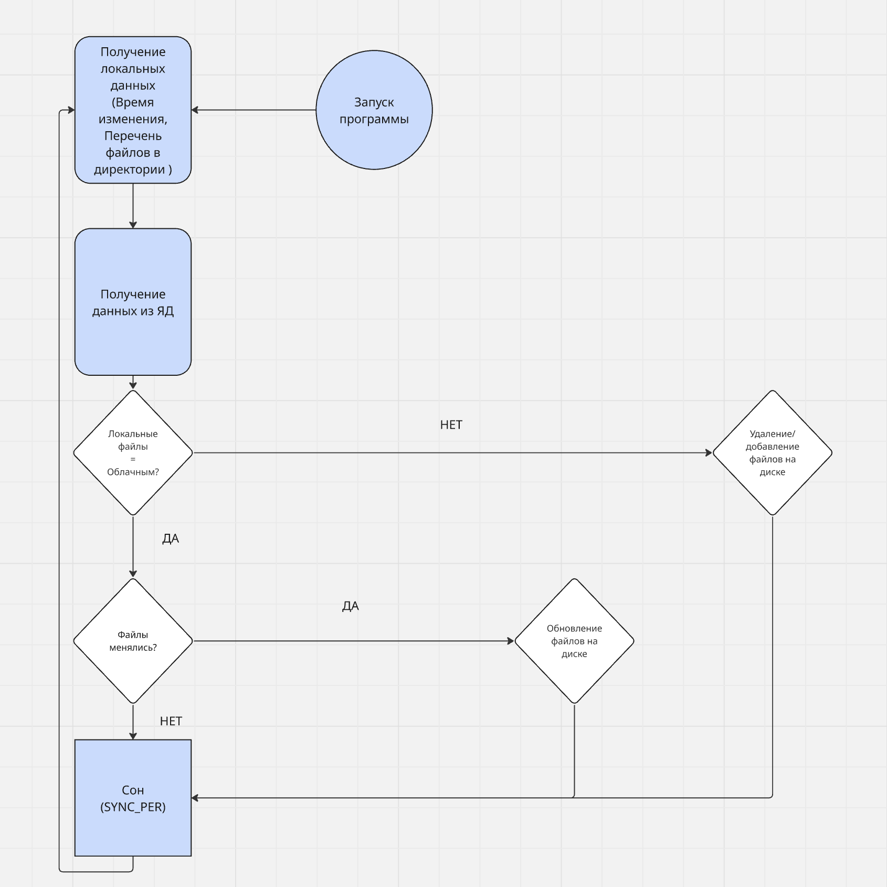

# Yandex Disk File Sync

Автоматизированный Python-сервис для **синхронизации локальной директории с Яндекс.Диском**.
Предназначен для резервного копирования, обновления и удаления файлов в облаке в режиме реального времени.

---

## Описание

Этот проект решает задачу **автоматической синхронизации** содержимого между локальной папкой и облачным хранилищем Яндекс.Диска.
Он особенно полезен:
- для бэкапа документов;
- автоматической загрузки файлов на облако;
- контроля изменений без участия пользователя.

Сервис написан на Python, использует API Яндекс.Диска и работает в фоне с периодическим обновлением.

---

## Визуальные материалы

### Структура проекта
FileSync/
│
├── main.py                  # Точка входа: логика синхронизации и управление циклом
├── .env                     # Файл конфигурации (токен, пути, период синхронизации)
├── log.txt                  # Файл логов
├── requirements.txt         # Список зависимостей
│
├── models/
│   └── models.py            # Класс Connector: взаимодействие с API Яндекс.Диска
│
├── utils/
│   └── methods.py           # Вспомогательные функции: работа с локальными файлами и API
│
├── README.md                # Документация проекта

### Визуализация Логики:
## Визуализация логики


_Схема логики работы проекта Yandex Disk File Sync_

---

## Технические требования

- Python 3.10+
- Подключение к интернету
- Аккаунт Яндекс.Диска с доступным OAuth токеном
- ОС: Windows / macOS / Linux

Установленные библиотеки:
- `requests`
- `python-dotenv`

---

## Установка и настройка

1. **Клонируйте репозиторий:**

    ```bash
    git clone https://github.com/vanopavlo/FileSync.git
    cd FileSync
    ```

2. **Создайте файл `.env` со следующей структурой:**

    ```env
    TOKEN=ваш_oauth_токен_яндекс_диска
    LOCAL_PATH=путь_до_локальной_папки
    CLOUD_PATH=имя_папки_на_диске
    SYNC_PER=5  # период синхронизации в секундах
    ```

3. **Установите зависимости:**

    ```bash
    pip install -r requirements.txt
    ```

4. **Запустите скрипт:**

    ```bash
    python main.py
    ```

---

## Использование

Программа:
- загружает файлы, если они есть локально, но отсутствуют в облаке;
- удаляет файлы из облака, если они удалены локально;
- перезагружает изменённые локальные файлы;
- ведёт лог в `log.txt`.

> Файлы не удаляются с локальной машины — синхронизация работает **в сторону облака**.

---

## Функциональность

- [x] Автоматическая односторонняя синхронизация с Яндекс.Диском
- [x] Обработка загрузки, удаления и обновлений файлов
- [x] Обработка ошибок с логированием
- [x] Параметры синхронизации через `.env`
- [x] Гибкая настройка локального и облачного пути

---

## Документация

- [API Яндекс.Диска (официальная документация)](https://yandex.ru/dev/disk-api/doc/ru/)
- Комментарии в коде поясняют архитектуру и логику работы

---

## Как внести свой вклад

1. Сделайте форк репозитория
2. Создайте ветку `feature/<название-фичи>`
3. Внесите изменения и создайте Pull Request
4. Соблюдайте стиль `PEP8`, сопровождайте код комментариями
5. Обновите `README.md`, если добавили новый функционал

---

## Лицензия

N/A

---

## Контактные данные

**Автор:** Иван 
**Telegram:** @illidar


---

## Благодарности и кредиты

- Яндекс за предоставленный API Диска
- Разработчики библиотек `requests` и `dotenv`
- Спасибо Skillbox за интересную задачу!
